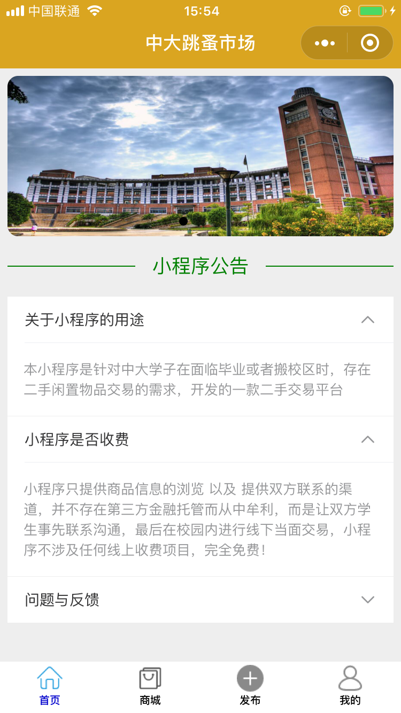
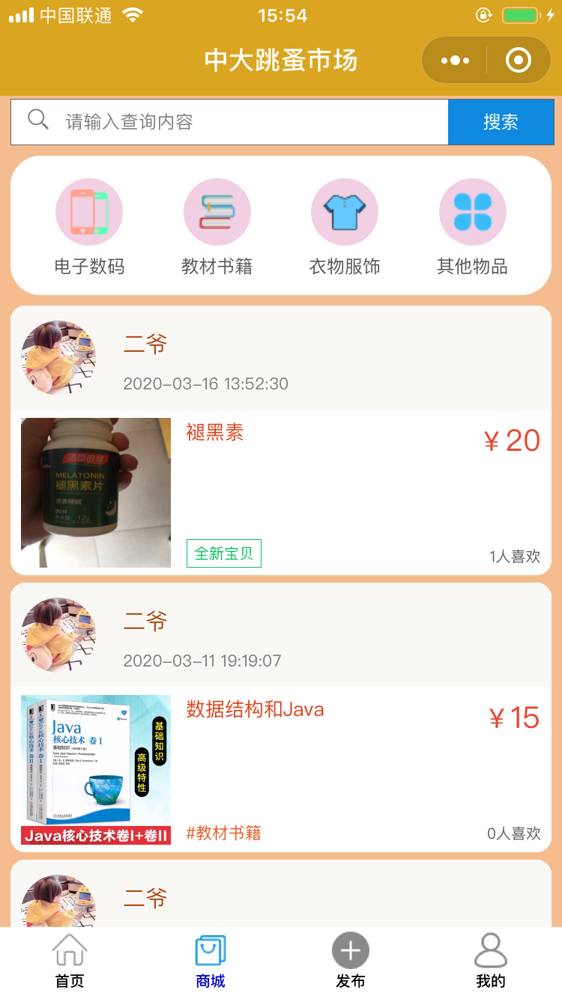
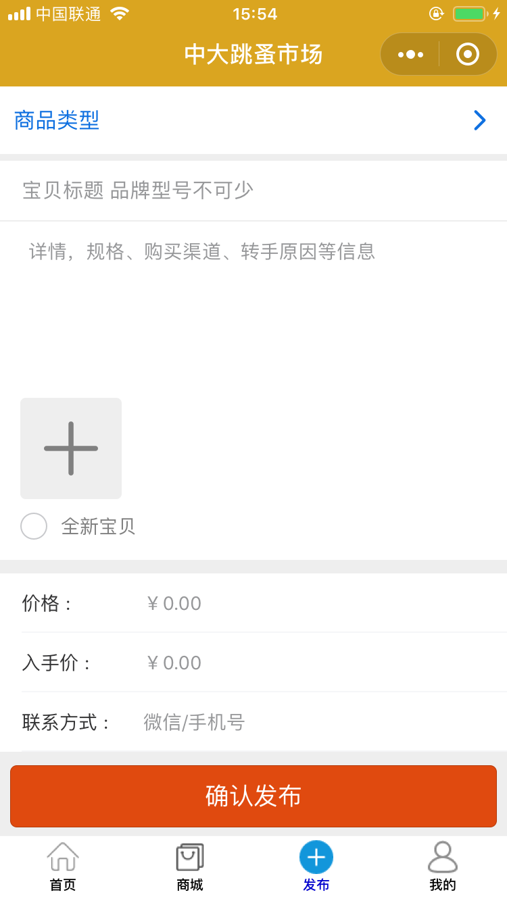
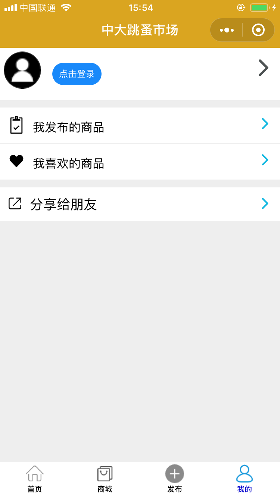
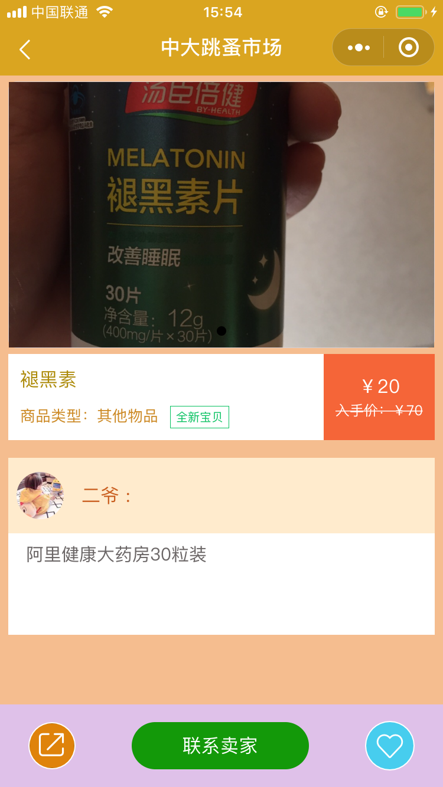
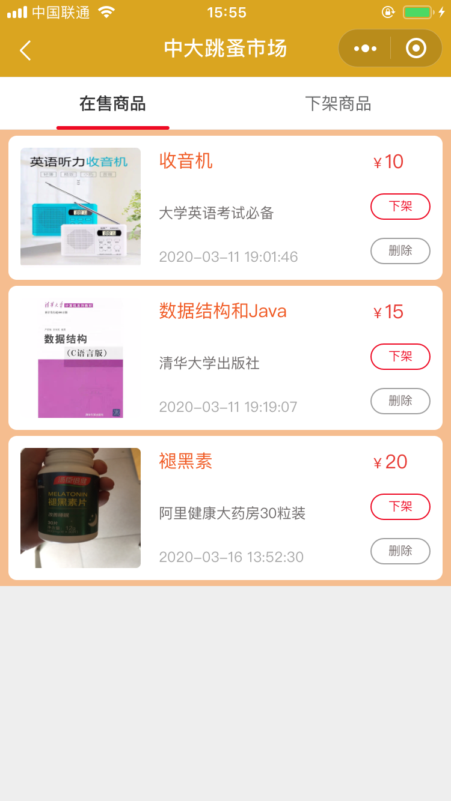
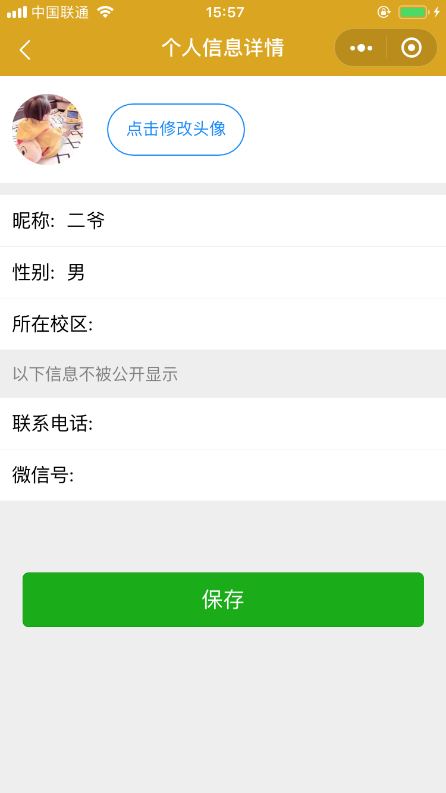

## 选题目的
中山大学学子在面临毕业或者校区变动时，会有较多书籍等物品难以携带，直接丢弃过于浪费且不环保，所以存在相当大的二手物品交易需求。为增大资源的回收利用率，帮助同学们更全面高效的进行二手物品交易，开发一款线上的信息发布和展示平台意义重大，作为近两年非常热门的新技术，微信小程序，拥有兼容安卓和 ios 端设备、无须下载安装等多方面的优点，故决定开发一款校园二手商城微信小程序。

## 小程序核心界面

tab页面：
- 首页：小程序说明，及公告发布
- 商城页：展示二手商品信息，提供搜索功能，商品分类筛选功能
- 发布页：表单，发布二手商品信息
- 我的：展示当前登录用户，管理自己发布的商品信息，自己喜欢的物品信息，以及提供分享到微信好友/朋友圈功能

 
 
 
 

其它页面：
- 商品详情页：点击任何地方的商品展示信息，都会跳转到该商品的详情页
- 我发布的：点击我的页面，我发布的，或者在商品展示信息中点击发布者的头像，都能跳转到该用户发布的商品
- 用户中心：可以更改提交自己的头像，昵称，联系信息等信息

 
 
 

## 已上线体验版本
扫描下面二维码，申请体验

 

